<p align="center">
  
</p>

<h1 align="center">Dokku Console</h1>

<p align="center">
  Manage <a href="https://dokku.com">Dokku</a> servers from your phone or desktop.<br>
  SSH straight from the device, the real <code>dokku</code> command behind every button, nothing to install on the server.
</p>

<p align="center">
  <a href="https://github.com/iamvivekkaushik/dokku-ui/actions/workflows/ci.yml"></a>
  <a href="https://github.com/iamvivekkaushik/dokku-ui/releases/latest"></a>
</p>

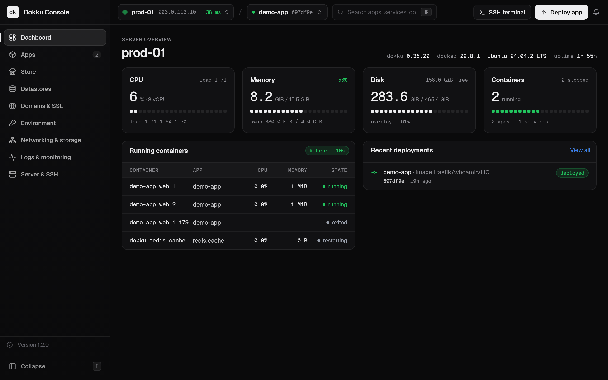

## Highlights

- **Straight to the server.** The app opens an SSH connection from the device
  and runs the same `dokku` commands you would type. There is no backend to
  host, no agent, and nothing to install on the Dokku server.
- **The command is never hidden.** Every action shows the command it is about
  to run, and the Console in each app accepts any `dokku` command. `enter`,
  `run` and the SSH terminal open a full interactive terminal.
- **The whole of Dokku.** Apps, deploys and builders, processes and scaling,
  config, domains and certificates, ports, storage and networks, datastores,
  logs and events, SSH keys, plugins, install and upgrade.
- **A store of templates.** n8n, Node-RED, Windmill, Gitea, Keycloak,
  Vaultwarden, Wiki.js, Docmost, Mattermost, Planka, Uptime Kuma, ntfy, Ghost
  and a dozen more install in one go from their official images, with
  persistent storage, config, datastores and a domain set up the Dokku way.
  A datastore is provisioned with its plugin, or taken from wherever one
  already runs, by URL. Every command is shown first; the result is an
  ordinary app.
- **Careful with what matters.** Host keys are pinned, secrets are masked in
  previews and logs, and destroying an app means typing its name after reading
  what will go.
- **Keeps itself current.** The app notices a new release and shows what
  changed. On Linux it updates itself in place and restarts; on Android,
  macOS and Windows it downloads the build.
- **One codebase, every screen size.** Built with Flutter for Android, iOS,
  Linux, macOS and Windows, with a phone layout of its own.

## Screenshots

<table>
  <tr>
    <td>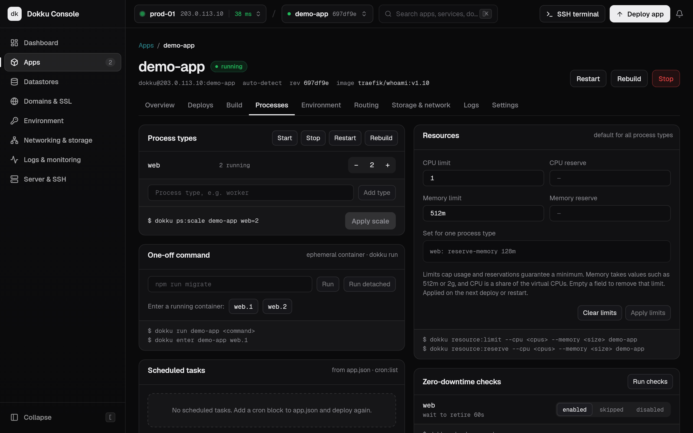</td>
    <td>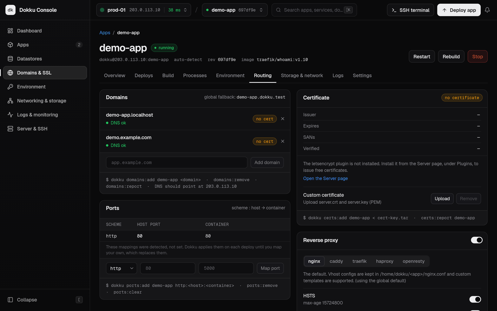</td>
  </tr>
  <tr>
    <td>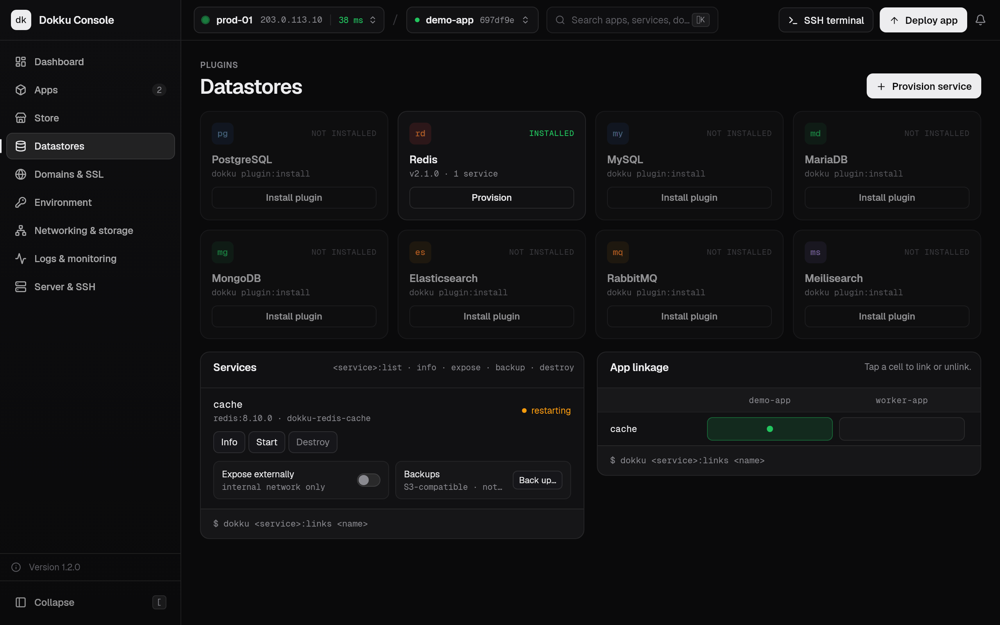</td>
    <td>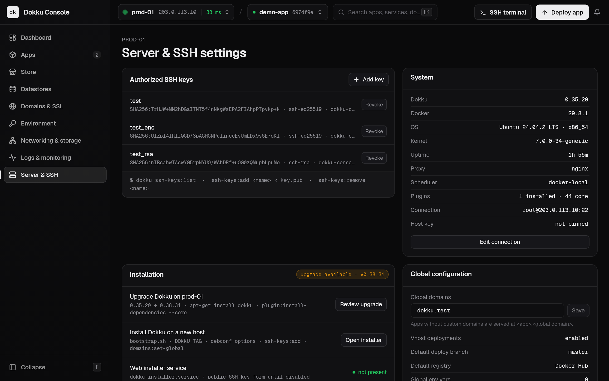</td>
  </tr>
  <tr>
    <td>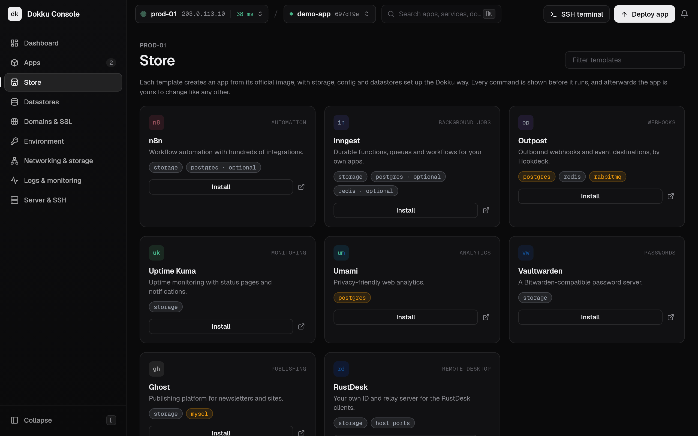</td>
    <td>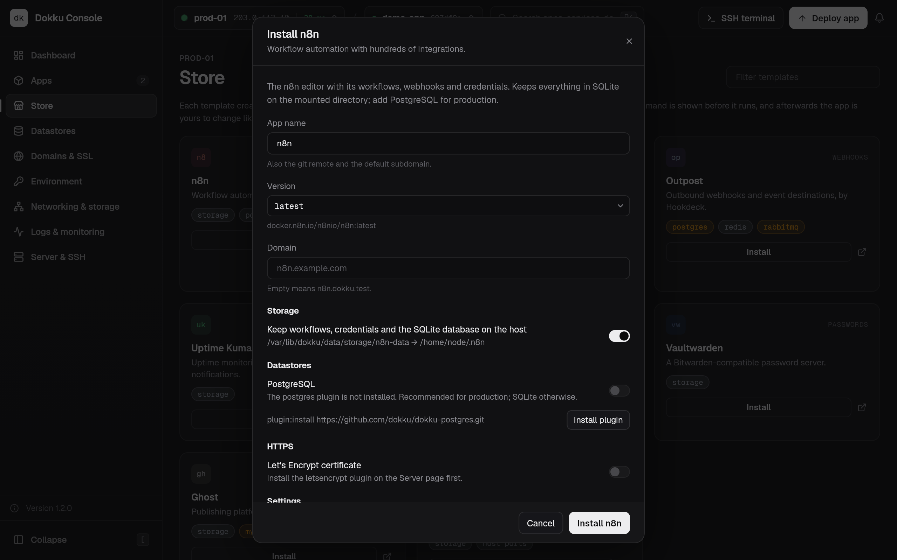</td>
  </tr>
  <tr>
    <td>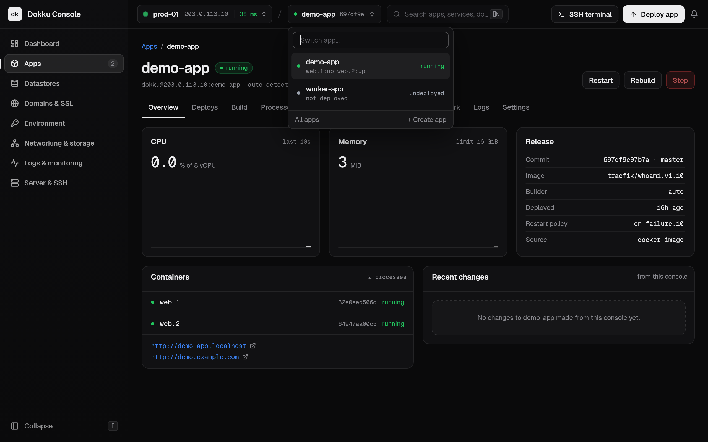</td>
    <td>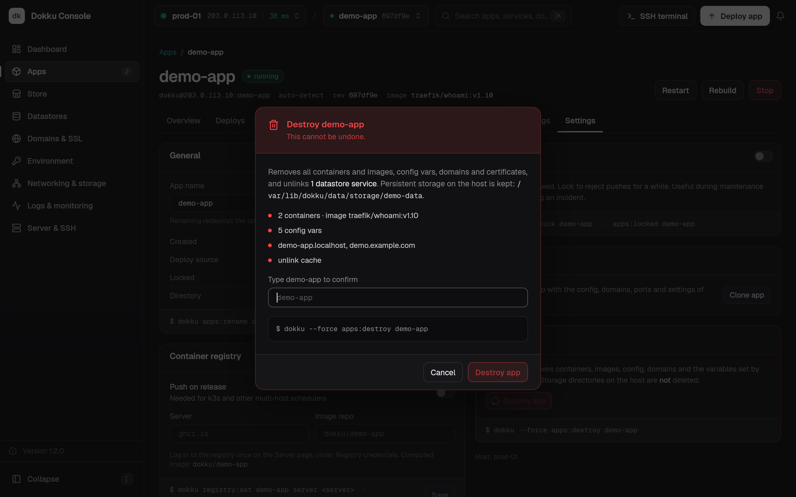</td>
  </tr>
</table>

<p align="center">
  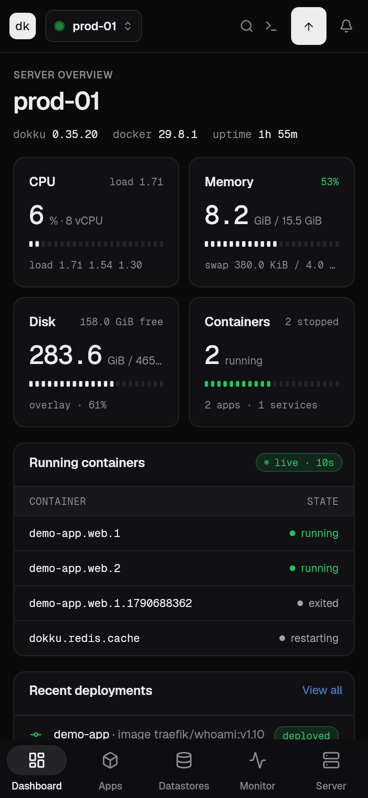
  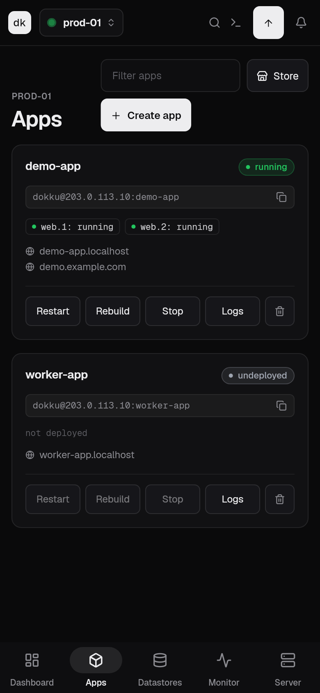
  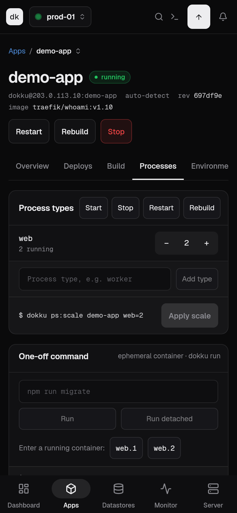
  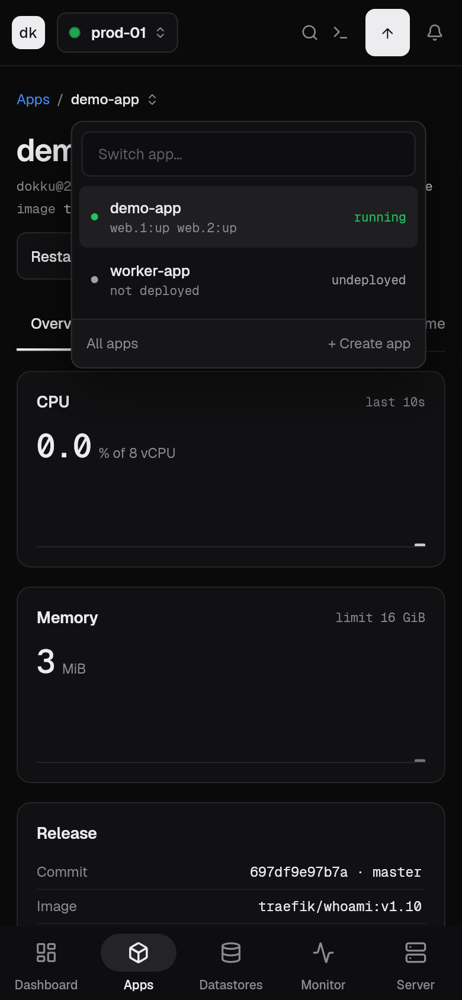
</p>

The screenshots show the app against output captured from a real Dokku 0.35
server. `python3 tool/screenshots.py` draws them again.

## Installing

Each [release](https://github.com/iamvivekkaushik/dokku-ui/releases) carries
an Android APK, a Linux bundle, a macOS app and a Windows folder.

On Linux, unpack the bundle where you want to keep it, then run the script
inside. It adds the app to the launcher, with its icon, running from that
folder:

```bash
tar -xzf dokku-console-linux-x64.tar.gz
```

```bash
dokku-console/install.sh
```

Run it again after moving the folder or unpacking a new version over it;
`install.sh --uninstall` takes the app out of the launcher. Run as root, it
registers the app for every user. The bundle needs GTK 3, libsecret and
jsoncpp from the system, which on Debian or Ubuntu are the packages
`libgtk-3-0`, `libsecret-1-0` and `libjsoncpp25`.

The macOS build is not signed with a developer identity. The first time, open
it with right-click, **Open**. Keys are kept in the login keychain.

On Windows, unpack `dokku-console-windows-x64.zip` where you want to keep it
and run `dokku_console.exe` inside. This build is not signed either, so
SmartScreen stops it the first time: **More info**, then **Run anyway**. The
Visual C++ runtime the app needs is in the folder. Keys are kept as files
encrypted with a key the Credential Manager holds.

iOS builds from source; see [Building](#building).

**Updating.** The app asks GitHub for the newest release when it starts. The
bell in the top bar and the sidebar footer say when there is one, with the
changelog. On Linux, **Update and restart** downloads the bundle, swaps it in
place and restarts; on Android it downloads the APK to install, on macOS the
zip to drag over the app, on Windows the zip to unpack over the folder.

## Connecting a host

| Sign in as | What works |
| --- | --- |
| `dokku` | Everything Dokku allows remotely: apps, deploys, config, domains, certificates, storage, datastores, logs. |
| `root`, or a sudo user with **Run dokku with sudo** | All of the above, plus SSH key management, plugin install and update, Dokku upgrade and install, host CPU, memory and disk metrics, per-container metrics, the interactive SSH terminal, and Store templates that hand their storage to the uid the image runs as. |

Dokku itself refuses `ssh-keys:add/remove` and `plugin:install/update` for the
`dokku` user, so those buttons are disabled with an explanation in that mode. A
sudo user needs passwordless sudo.

You can sign in with a pasted private key (ed25519, RSA or ECDSA, with or
without a passphrase), a key file on the device (desktop only), or a password.
Saving a host requires a successful connection test.

## Where data is stored

Everything stays on the device.

| What | Where |
| --- | --- |
| Private keys, key passphrases, SSH passwords | The device keystore: Android Keystore, the Keychain on iOS and macOS, libsecret (GNOME Keyring, KWallet) on Linux, and on Windows files encrypted with a key the Credential Manager holds |
| Host address, port, username, pinned host key | App preferences |
| Activity log, with secrets removed | App preferences |
| Display preferences | App preferences |

Removing a host deletes its key from the keystore. Choosing **Key file** stores
only the path; the key stays in its file.

## Security

- **Host keys are pinned** on first connection and checked on every later one.
  A changed key blocks the connection and says why.
- **No shell injection.** Commands are built as argument lists. The subcommand
  name is validated and every argument is single-quoted before it reaches the
  remote shell.
- **Secrets are kept out of sight.** Config values, registry passwords and
  backup credentials are masked in command previews and in the activity log.
  Registry passwords are sent on stdin rather than as arguments. Config values
  are sent base64-encoded, so multi-line values and special characters arrive
  intact.
- **Destructive actions ask first.** Destroying an app or a datastore requires
  typing its name.

## What it covers

| Area | Where | Dokku commands |
| --- | --- | --- |
| Apps | Apps, app Settings | `apps:create` `destroy` `list` `rename` `clone` `report` `lock` `unlock` |
| Store | Store | Installs a template: `apps:create` `storage:ensure-directory` `storage:mount` `config:set` `ports:set` `domains:set` `resource:limit` `<service>:create` `<service>:link` `docker-options:add` `proxy:disable` `git:from-image` `letsencrypt:enable`, and `chown` on the host for an image that runs as a uid Dokku cannot chown to |
| Deploys | Deploy app, app Deploys | `git:sync` `git:from-image` `git:set` `git:unlock` `builds:list` `builds:output` `builds:cancel` `ps:rebuild` |
| Builders | app Build | `builder:set` `builder:report` `builder-dockerfile:set` `buildpacks:add` `set` `remove` `clear` |
| Processes | app Processes | `ps:scale` `start` `stop` `restart` `rebuild` `ps:set` `run` `run:detached` `enter` `cron:list` `cron:run` |
| Config | app Environment | `config:export` `config:set` `config:unset` (with `--no-restart`), `.env` import and export |
| Routing | app Routing | `domains:add` `remove` `report` `certs:add` `remove` `report` `letsencrypt:enable` `disable` `auto-renew` `proxy:set` `enable` `disable` `ports:add` `remove` `nginx:set` |
| Storage and network | app Storage & network | `storage:mount` `unmount` `list` `ensure-directory` `docker-options:add` `remove` `report` `network:set` `create` `report` |
| Resources | app Processes | `resource:limit` `reserve` `limit-clear` `reserve-clear` `checks:run` `enable` `skip` `disable` `scheduler:set` |
| Logs | app Logs, Logs & monitoring | `logs -t -n -p` `logs:failed` `events -t` `events:on` |
| Datastores | Datastores | `<service>:create` `link` `unlink` `info` `list` `expose` `unexpose` `start` `stop` `backup` `backup-auth` `backup-schedule` `destroy` for postgres, redis, mysql, mariadb, mongo, elasticsearch, rabbitmq and meilisearch |
| Server | Server & SSH | `ssh-keys:list` `add` `remove` `plugin:list` `install` `update` `enable` `disable` `uninstall` `registry:login` `registry:set` `domains:set-global` |
| Install and upgrade | Install Dokku, Server & SSH | Generates and runs the official `bootstrap.sh`, apt or source install; upgrades with apt |

Anything else can be run from the **Console** in each app's Logs tab, which
accepts any `dokku` command. `enter`, `run` and the SSH terminal open a full
interactive terminal.

### Dokku version notes

Tested against Dokku 0.35 and written to the 0.38 command reference. Where they
differ the app adapts:

- `builds:list` exists from 0.38. On older versions the Deploys tab shows the
  deploys started from the app instead.
- There is no `builds:trigger` command in Dokku; **Trigger rebuild** runs
  `ps:rebuild`.
- `git:unlock` was folded into `apps:unlock` in newer versions; the app tries
  one and falls back to the other. Dokku 0.35 still lists `git:unlock` but
  fails with `command not found`, which is treated the same way.
- `registry:logout` exists from 0.38.
- Dokku ignores an empty value in `resource:limit`. To remove one limit the app
  clears the app's default limits and sets the remaining ones again.
- A port mapping that Dokku only detected cannot be removed, so it has no
  remove button. Mapping a port of your own replaces the detected ones.
- An app that speaks no HTTP, such as the RustDesk server, gets its ports
  published on the host through `docker-options` with the proxy disabled.
  Dokku starts the new container before stopping the old one, and two
  containers cannot hold the same host port, so such an app has to be stopped
  before it is deployed again. Its image brings its own init (s6-overlay),
  which has to be PID 1, so the template also turns off the `--init` Dokku
  gives every container, with `scheduler-docker-local:set init-process false`.
- `enter` names a container as `web.1`; anything after that is the command
  to run in it. Dokku starts `/bin/bash` unless `DOKKU_APP_SHELL` says
  otherwise, so on an image without bash the terminal opens `sh` instead.

## Building

```bash
flutter pub get
flutter run
```

Requires Flutter 3.44 or newer. On Linux, building also needs the libsecret
headers:

```bash
sudo apt install libsecret-1-dev libjsoncpp-dev
```

Release builds:

```bash
flutter build apk --release
```

```bash
flutter build linux --release
```

```bash
flutter build macos --release
```

The Linux bundle lands in `build/linux/x64/release/bundle`, install script
included. `flutter build macos`, `ios` and `windows` need to run on those
systems; the Windows one wants Visual Studio with the Desktop development with
C++ workload.

The Android release build is signed with the debug key until you add your own
[signing configuration](https://docs.flutter.dev/deployment/android#signing-the-app),
which is fine for installing it yourself but not for the Play Store.

### Continuous integration

`.github/workflows/ci.yml` runs on every push and pull request:

| Job | Does |
| --- | --- |
| `test` | `flutter analyze`, `flutter test`, and a check that `CHANGELOG.md` has a section for the version in `pubspec.yaml` |
| `android` | Builds the release APK and keeps it as a build artifact |
| `linux` | Builds the Linux bundle, tries its install script and keeps the bundle as a build artifact |
| `macos` | Builds the macOS app and keeps it, zipped, as a build artifact |
| `windows` | Builds the Windows app, adds the Visual C++ runtime DLLs and keeps the folder, zipped, as a build artifact |
| `release` | On a tag like `v1.2.0`, creates a GitHub release with that version's changelog section as its notes and all four builds attached |

To publish a release, turn the `Unreleased` section of `CHANGELOG.md` into the
version with the date, set the same version in `pubspec.yaml` and in
`lib/core/version.dart` (a test checks the three agree), commit, and tag:

```bash
git tag v1.5.0 && git push origin v1.5.0
```

## Testing

```bash
flutter test
```

| Suite | Checks |
| --- | --- |
| `test/core` | Quoting, redaction, parsers, tar, host scripts, the install script |
| `test/data` | Host and secret storage |
| `test/state` | Running commands: failures, retries, what is logged |
| `test/widgets` | The shared widget kit |
| `test/screens` | Every screen at phone, tablet and desktop widths, against output captured from a real Dokku server. Layout overflow fails these tests. |
| `test/screenshots` | Draws the README screenshots from the same output. Skipped unless `SCREENSHOTS` names a folder; `tool/screenshots.py` runs it. |
| `test/integration` | Against a live server. Skipped unless configured. |

The live suite has two parts. `ssh_live_test.dart` covers the SSH layer: keys,
host key checks, quoting, streams and terminals. `dokku_commands_live_test.dart`
runs every kind of change the app makes (create, deploy, scale, config,
domains, certificates, storage, networks, datastores, SSH keys) on throwaway
apps named `e2e-*`, and removes them afterwards. Run it against a new Dokku
version to see what changed.

To run the live suite, start a disposable Dokku and point the tests at it:

```bash
docker run -d --name dokku-test -p 127.0.0.1:3022:22 \
  -v /var/run/docker.sock:/var/run/docker.sock dokku/dokku:0.35.20
```

The suite expects these keys in one directory, each added to both the `dokku`
user (`dokku ssh-keys:add`) and root's `authorized_keys`: `test` (ed25519),
`test_rsa`, `test_enc` (passphrase `correct horse`), and `unknown` (not added
anywhere). It also expects an app named `demo-app`, and the server must be able
to pull `traefik/whoami:v1.10` (set `DOKKU_TEST_IMAGE` to use another image)
and `nginx:1.27-alpine` (`DOKKU_TEST_SHELL_IMAGE`), an image with `sh` but no
`bash`, for the `enter` test.
Do not point it at a server you care about.

```bash
DOKKU_TEST_KEYS=/path/to/keys DOKKU_TEST_PORT=3022 flutter test test/integration
```

## Project layout

```
lib/core/          Pure Dart: command quoting, parsers, install script, host scripts, the Store's templates
lib/data/          SSH service, host and secret storage
lib/state/         Riverpod providers: hosts, cached lookups, jobs, routing
lib/ui/            Theme, widget kit, app shell, screens
linux/packaging/   Launcher entry, icons and install script shipped in the Linux bundle
docs/screenshots/  What the README shows, drawn by test/screenshots
tool/              Draws the launcher icons and the screenshots; reads the changelog for releases
test/              See above
```
